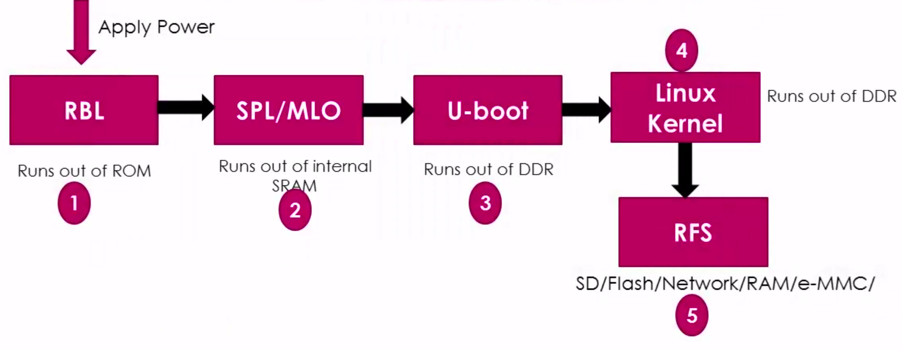
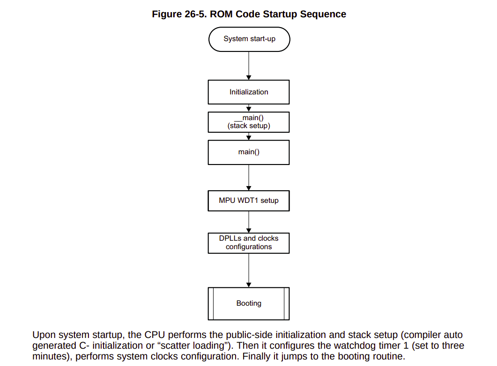
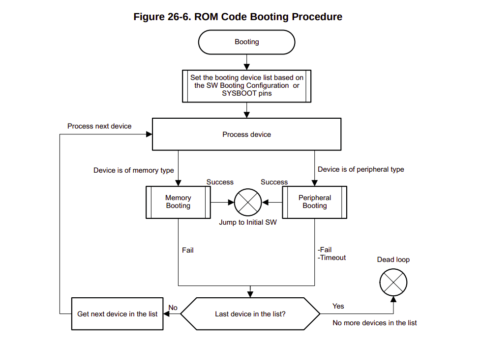
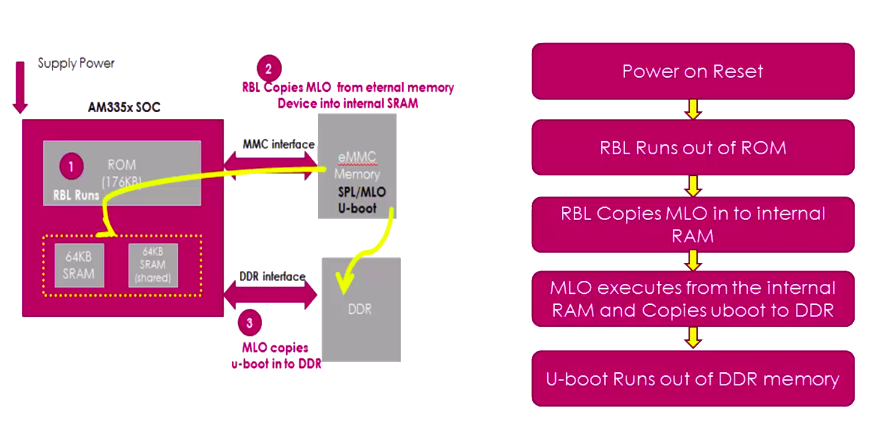
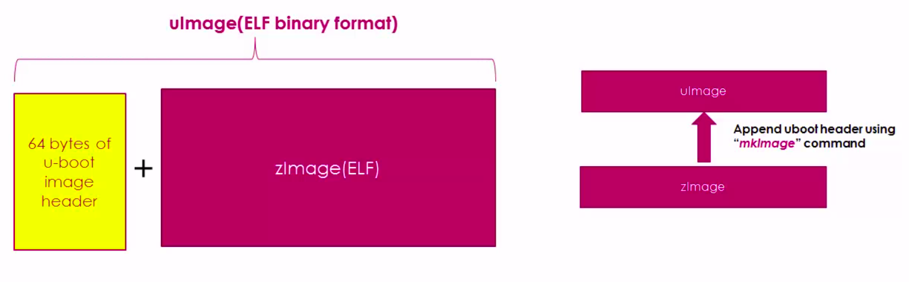
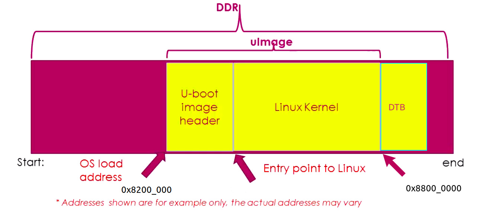
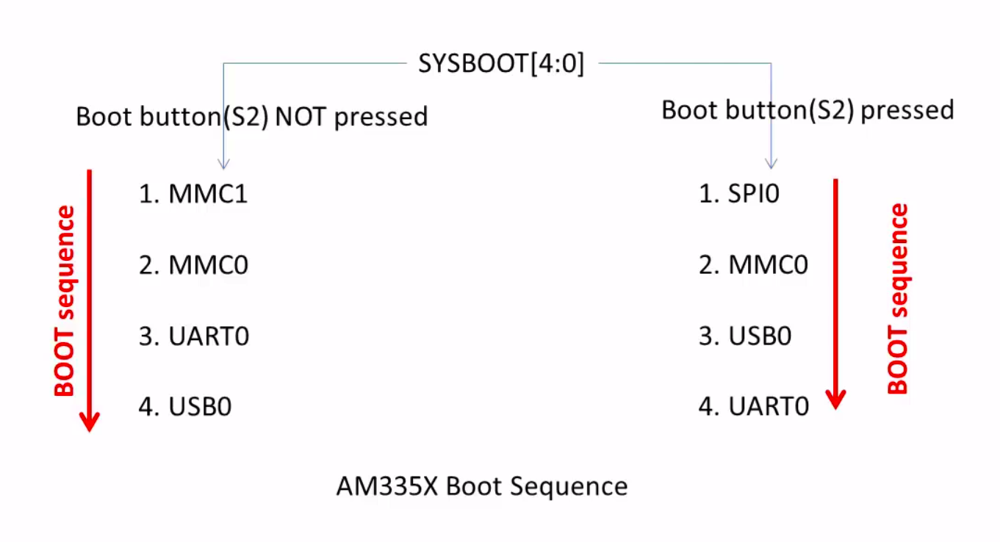
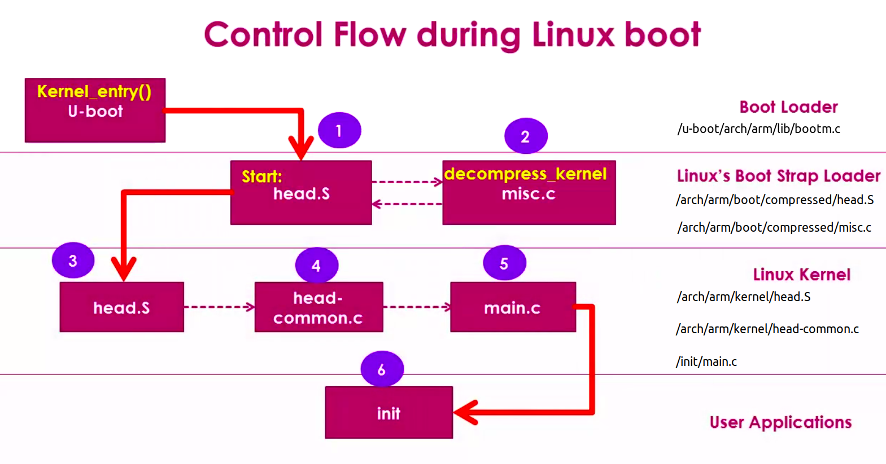

<h1> Start-up and Configuration <h1>

## Stage Boot of BBB



### 1. RBL - ROM Bootloader
- This code is permanently burned into AM335x chip, cannot be changed
- When the power is applied, the CPU runs this code first
- Task: minimual HW initialization: clock, pin muxing, then search for the next stage boot (SPL)
- Default boot order: MMCO(Sdcard) -> MMC1 (0n-board eMMC) -> UART0 -> USB0. This order can be changed depending on 
  the state of SYSBOOT pin




### 2. SPL- Second Program Loader (MLO)


- This file is located at the start of sdcard (typically on the FAT partition)
- The SPL is a very compact bootloader (limited on-chip SRAM)
- Task: 
    * Initialize DDR RAM (configure external memory)
    * Additional basic HW initialization (pin muxing, full clock)
    * Load U-boot from the storage into DDR RAM
- Usually build together with U-boot (same source code, using CONFIG_SPL)

### 3. Uboot (Main Bootloader)
- The file is typycally named u-boot.img
- The full-featured bootloader, providing:
    * Command-shell to interrupt boot (press any key within a few sec to enter U-boot console)
    * Read the uEnv.txt file to obtain boot environment variables (Boot args, kernel image, devicetree, etc)
    * Support multiple loading protocols: MMC, USB, UART, Network, ...
- Main Task:
    * Load Linux Kernel (zImage) and the devicetree (.dtb) into RAM
    * Set up the kernel cmd parameter (console =, root = ), then jump to the kernel's entry point

#### Show detail
**Step 1:** u-boot.img looking for uImage (Kernel image), uImage is nothing but zImage plus u-boot header

  

**Step 2:** Reading u-boot header (64bytes) of the uImage manually (dump header)
```shell
  cd u-boot/include; vi +307 image.h
```
```text
    typedef struct image_header {
        uint32_t ih_magic;          /* Image Header Magic Number */
        uint32_t ih_hcrc;           /* Image Header CRC Checksum */
        uint32_t ih_time;           /* Image Creation Timestamp */
        uint32_t ih_size;           /* Image Data Size */
        uint32_t ih_load;           /* Data Load Address */
        uint32_t ih_ep;             /* Entry Point Address */
        uint32_t ih_dcrc;           /* Image Data CRC Checksum */
        uint8_t ih_os;              /* Operating System */
        uint8_t ih_arch;            /* CPU architecture */
        uint8_t ih_type;            /* Image Type */
        uint8_t ih_comp;            /* Compression Type */
        uint8_t ih_name[IH_NMLEN];  /* Image Name */
    } image_header_t;
```

- How to dump memory in U-Boot stage:
    + Step 1: Press space bar after when you power on

    + Step 2: Load uImage in to the DDR address (0x8200_0000)\
`=> load mmc 0:1 0x82000000 uImage`
```text
    reading uImage
    8957456 bytes read in 563 ms (15.2 MiB/s)
```

   + Step 3: Use "md" commad to show memory infomation\
`=> md 0x82000000 10`
```text
    82000000: 56190527 4ef60b6b a920495f d0ad8800    '..Vk..N_I .....
    82000010: 00800080 00800080 39386b9d 00020205    .........k89....
    82000020: 756e694c 2e342d78 35312e34 00000035    Linux-4.4.155...
    82000030: 00000000 00000000 00000000 00000000    ................
```
Or use "imi" commad such as:\
`=> imi 0x82000000`
```text
    ## Checking Image at 82000000 ...
      Legacy image found
      Image Name:   Linux-4.4.155
      Created:      2020-08-28  15:20:09 UTC
      Image Type:   ARM Linux Kernel Image (uncompressed)
      Data Size:    8957392 Bytes = 8.5 MiB
      Load Address: 80008000
      Entry Point:  80008000
      Verifying Checksum ... OK
```

**Step 3:** How U-boot hands off control to the Boot Strap Loader of the Linux kernel
- Let's go to the "bootm.c" file of the U-Boot source code and Explore
```shell
  cd u-boot-2017.05-rc2/arch/arm/lib/bootm.c
```
- In the boot_jump_linux(): this function pointer is initialized to entry point address\
`kernel_entry = (void (*)(int, int, uint))images->ep;`
- And this code hand off control to the Linux\
`kernel_entry(0, machid, r2);`\
  it actually sends three important arguments:
    + 0: it actually ignored by the Linux.
    + machid: machine id of the board which is detected by the u-boot, passed to linux via r1.
    + r2: address of DTB (FTB) present in the DDR RAM
      
**Location on memory**
  
  **Note**
  - Load address (download address): this is the address in memory space where you download the uImage file
  to the first address of the uImage file in the system memory (RAM or parallel NOR flash,..etc). 
  - A modern U-Boot, for TI platforms such as the Beaglebone Black will have a default environment that uses 
  addresses based on that document. Looking at the [code](https://elixir.bootlin.com/u-boot/latest/source/include/configs/ti_armv7_common.h#L33) in U-Boot we see that the uImage is loaded to 0x82000000 and the device tree to 0x88000000.


### 4. AM335x & Linux Boot Sequence



### 5. Flow summary

```text
ROM Code (on-chip, fixed)
   ↓
SPL / MLO (initializes DDR, loads U-Boot)
   ↓
U-Boot (u-boot.img — reads uEnv.txt, loads kernel + dtb)
   ↓
Linux Kernel (zImage + device tree)
   ↓
Init/systemd → Userspace
```